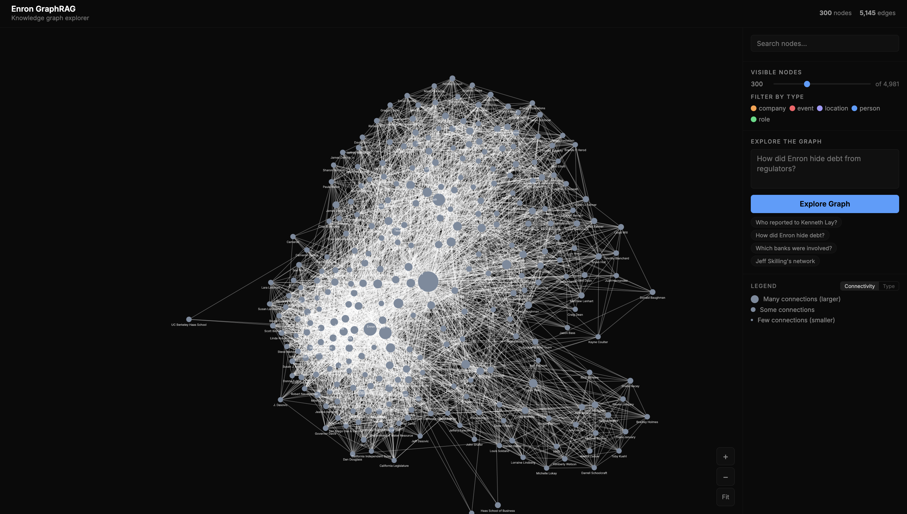
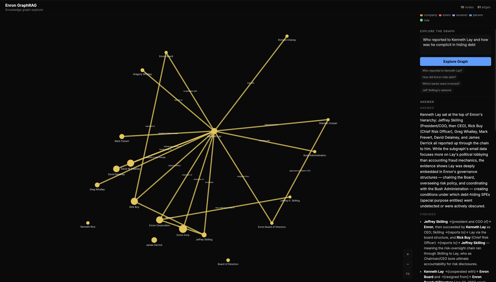
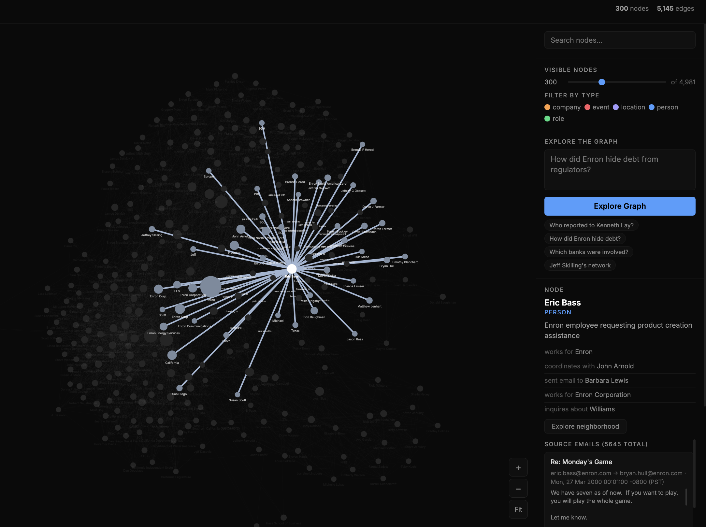

# Enron GraphRAG

A knowledge graph explorer built from the Enron email corpus. 100,000 internal emails are processed through entity extraction (Claude Haiku), merged into a knowledge graph, and served via an interactive D3.js force-directed visualization with natural language querying (Claude Sonnet) grounded in both graph structure and original email content.







## Architecture

```
data/enron_emails.zip (517k emails, CSV inside)
        │
        ├──► build/extract.py     Claude Haiku extracts entities + relationships
        │                          Outputs build/results/extracted.jsonl
        │
        ├──► build/merge.py       Deduplicates, resolves names, builds graph
        │                          Outputs graph.json (~5k nodes, ~50k edges)
        │
        └──► server.py            First run: builds data/emails.db (SQLite, 517k emails)
              │                    Serves frontend, graph, email lookups, and
              │                    streaming Sonnet queries with email context
              ▼
        frontend/index.html        D3.js SVG graph + query UI
```

### `build/extract.py`

Reads emails from `data/enron_emails.zip`, sends each to Claude Haiku for entity/relationship extraction using asyncio with a configurable concurrency semaphore. Outputs one JSONL record per email to `build/results/extracted.jsonl`. Supports `--resume` to skip already-processed emails.

### `build/merge.py`

Loads all JSONL extraction results, deduplicates entities by normalized name, picks the most common capitalization as the canonical label, resolves type conflicts by majority vote, and merges parallel edges by summing weights. Each node retains a `chunks` array of email file paths it was extracted from — these are pointers back to the original emails. Exports `graph.json` trimmed to the top 5,000 nodes by degree (configurable via `--top`).

### `server.py`

Flask server with four endpoints:

| Endpoint | Method | Description |
|---|---|---|
| `/` | GET | Serves the frontend |
| `/graph.json` | GET | Serves the knowledge graph |
| `/query-stream` | POST | Subgraph retrieval + email context + Claude Sonnet streaming via SSE |
| `/emails` | POST | Returns parsed emails for a list of chunk file paths |

On startup:
1. Builds an in-memory **keyword index** and **adjacency map** from `graph.json` (instant)
2. Opens `data/emails.db` — a SQLite database of all 517k emails indexed by file path. On first run, this DB is built automatically from `data/enron_emails.zip` (~60s). Subsequent startups are instant.

### `frontend/index.html`

Single-file D3.js application. SVG force-directed layout with:
- Zoom, pan, drag
- Hover highlighting (dims unconnected nodes, shows edge labels)
- Node search with degree counts
- Entity type filtering
- Streaming query panel with structured answers
- Source email display when clicking any node

## How to run

### Prerequisites

- Python 3.8+
- An Anthropic API key

### Setup

```bash
cp .env.example .env
# Edit .env and add your ANTHROPIC_API_KEY

pip install -r requirements.txt
```

### Build the graph (if starting from raw emails)

```bash
# Place enron_emails.zip in data/
python build/extract.py                # full run (~100k emails)
python build/extract.py --sample 1000  # quick test
python build/extract.py --resume       # resume interrupted run

python build/merge.py                  # produces graph.json
python build/merge.py --top 3000       # smaller graph
```

### Start the server

```bash
python server.py
# open http://localhost:5000
```

First startup builds `data/emails.db` from the zip (~60 seconds, one-time). After that, startup is instant.

## Features

- **Node sizing by degree** — nodes with more connections are visually larger
- **Two coloring modes** — uniform (connectivity) or type-based (person, company, role, event, location), toggled via legend
- **Entity type filters** — checkboxes to show/hide each node type
- **Node search** — incremental text search with type and degree count, click to zoom
- **Explore neighborhood** — click a node, then "Explore neighborhood" to filter to its 2-hop subgraph
- **Hover highlighting** — hover any node to dim unrelated nodes and show edge labels on connected links
- **Source emails** — click any node to see the original Enron emails that mention it (subject, from, to, date, scrollable body)
- **Natural language queries** — ask questions in plain English, get structured answers (direct answer + detail bullets + key paths) grounded in both graph relationships and original email content
- **Query result highlighting** — matched nodes turn gold, graph auto-zooms to the relevant subgraph
- **Streaming responses** — answers stream in via SSE with progress indicators

## How querying works

When a user types a question like *"How did Enron scam people?"* and hits "Explore Graph", the following happens:

### Step 1: Find the relevant subgraph

The full graph has ~5,000 nodes and ~50,000 edges — too large to send to an LLM. The server needs to extract just the relevant portion.

```
User question: "How did Enron scam people?"
                    │
                    ▼
            Tokenize + remove stopwords
            → ["enron", "scam", "people"]
                    │
                    ▼
        Score every node in the full graph:
        keyword index maps "enron" → [node "enron", node "enron corp.", ...]
                    │
                    ▼
        Top 50 scoring nodes become "seeds"
        e.g. "enron", "enron corp.", "securities and exchange commission", ...
                    │
                    ▼
        Expand each seed to its 1-hop neighbors via the adjacency map
        (capped at 200 total nodes)
                    │
                    ▼
        Collect all edges between these 200 nodes
                    │
                    ▼
        Result: a focused subgraph (~200 nodes, ~1k edges, ~50k tokens)
        instead of the full graph (~5k nodes, ~50k edges, ~1.6M tokens)
```

This runs in milliseconds using two in-memory indexes built at startup:
- **Keyword index**: maps each word → list of node IDs whose label/description contains it
- **Adjacency map**: maps each node ID → set of neighbor node IDs

### Step 2: Retrieve source emails

Each node in the graph has a `chunks` array — file paths pointing back to the original emails it was extracted from:

```json
{
  "id": "federal bureau of investigation",
  "label": "Federal Bureau of Investigation",
  "type": "company",
  "chunks": ["bailey-s/deleted_items/75.", "bass-e/deleted_items/75.", "blair-l/deleted_items/578.", ...]
}
```

These paths (e.g. `blair-l/deleted_items/578.`) are primary keys in `data/emails.db`, a SQLite database of all 517,401 Enron emails. The server collects all chunk paths from the top seed nodes (up to 100 candidates), fetches them in a single `WHERE file IN (...)` query, scores each by subject-line keyword overlap with the question, and returns the top 10:

```
Seed nodes → collect all chunk paths (up to 100 total)
    → SELECT file, message FROM emails WHERE file IN (...)   [one query]
    → for each result: score subject line against question keywords
    → sort by score descending, take top 10

Example — question: "FBI investigation into Enron"
    candidate subject "Cooperation with the FBI"     → score 2 ("fbi", "cooperation"... wait, "fbi" not in question — score 1)
    candidate subject "Re: Q3 earnings call"         → score 0
    candidate subject "Enron FBI search warrant"     → score 2  ← wins
```

Each excerpt is truncated to 400 chars and tagged with the entity it relates to.

### Step 3: Send to Claude Sonnet

The server sends a single prompt containing:

1. **System prompt** — instructs Sonnet to act as a graph analyst, cite entities by name, trace paths using edge labels, and cite evidence from emails
2. **Subgraph JSON** — the 200-node subgraph with node labels, types, descriptions, and edge labels/weights
3. **Email excerpts** — up to 10 parsed emails from the seed nodes
4. **The user's question**

Total context is typically 50-70k tokens (well within Sonnet's 1M limit).

### Step 4: Stream the response

Sonnet returns structured JSON streamed via Server-Sent Events:

```json
{
  "nodeIds": ["enron", "federal bureau of investigation", "securities and exchange commission", ...],
  "edgeIds": ["enron|federal bureau of investigation", ...],
  "answer": "The Enron scandal involved manipulating California energy markets, hiding debt through off-balance-sheet entities...",
  "details": [
    "**Federal Bureau of Investigation** →[investigating]→ **Enron** — an internal email from jr..legal@enron.com dated Jan 23 2002 confirms the FBI was authorized to search Enron's offices...",
    "**Enron Corporation** →[requested information from regarding related party transactions]→ **Securities and Exchange Commission**..."
  ],
  "paths": [
    "**Federal Bureau of Investigation** →[investigating]→ **Enron** →[filed Form 8-K with]→ **Securities and Exchange Commission**"
  ]
}
```

The frontend renders this as a structured answer panel (direct answer, bullet points, key paths) and highlights the returned `nodeIds` and `edgeIds` on the graph, auto-zooming to the relevant area.

### Why this works

The key insight is that the graph nodes act as an **index into the email corpus**. Instead of doing vector similarity search over 517k emails (expensive, needs embeddings), we:

1. Use the graph structure to find relevant entities (keyword matching + graph traversal)
2. Follow the `chunks` pointers on those entities to retrieve the actual emails
3. Send both the graph relationships AND the email evidence to the LLM

This gives Sonnet two complementary views: the **structural** view (who connects to whom, via what relationship) and the **textual** view (what was actually said in the emails). The result is answers that cite both graph paths and specific email content.

The frontend slider (max 800 nodes) only limits what's *displayed*. The server always searches the full 5,000-node graph.

## Known limitations

### Chunk cap and arbitrary ordering (`merge.py`)

Each node stores a `chunks` array — the email file paths it was extracted from. During the merge phase this list is deduplicated and hard-capped at 50 entries:

```python
chunks=list(set(node_chunks[norm_id]))[:50],  # cap for JSON size
```

**Why the cap exists:** A prominent entity like "Enron" or "Kenneth Lay" appears across tens of thousands of emails. Without a cap, `node_chunks["kenneth lay"]` would be a list of ~15,000 file paths. Storing that on every major node would make `graph.json` enormous — potentially hundreds of megabytes just in chunk arrays.

**Why this is a limitation:** `set()` in Python has no defined iteration order. The `[:50]` slice after it is arbitrary — not the 50 most relevant, most recent, or most informative emails. Just 50 from an unpredictable ordering. At query time, `server.py` then takes only `[:2]` of those 50 per seed node, so the two emails actually sent to the LLM as evidence are effectively random.

**Current approach — subject-line keyword scoring:**

The server collects all chunk paths across seed nodes (up to 100 candidates), fetches them in one `WHERE file IN (...)` query, scores each email's subject line against the question's keywords, and returns the top 10 by score. This is more defensible than taking arbitrary first-N chunks — a subject like `"Re: accounting irregularities"` will correctly beat `"Re: office party"` for a fraud question — but subject lines are short and may not reflect the email body's content. An email with a generic subject but highly relevant body content will still be overlooked.

**Further improvement — use embeddings for email retrieval:**

Sorting by subject keywords is still a proxy for relevance. The right fix is to decouple email retrieval from the graph entirely using embeddings:

**At build time (new Phase 3 after `merge.py`):**
- Embed each email's header + body using a text embedding model
- Store the embedding alongside the file path in a vector index (e.g. SQLite with `sqlite-vec`, or FAISS)

**At query time (replacing the chunk pointer lookup):**
- Embed the user's question
- Run a cosine similarity search over all email embeddings
- Return the top-K most semantically similar emails regardless of which nodes they came from

```
Current approach:               Embedding approach:
question                        question
    │                               │
    ▼                               ▼
score nodes by keyword          embed question
    │                               │
    ▼                               ▼
seed nodes → node.chunks        vector similarity search over all emails
    │                               │
    ▼                               ▼
fetch ≤2 emails per seed        fetch top-K most relevant emails
(arbitrary, graph-dependent)    (query-dependent, graph-independent)
```

This matters because the current system's email quality is entirely dependent on graph node quality — if an entity was poorly extracted or its chunk list landed on unhelpful emails, the LLM gets poor evidence. Embeddings bypass that dependency: a highly relevant email surfaces regardless of whether its entities scored well in the graph.

The two approaches are complementary rather than competing. The graph gives Sonnet the **structural view** (who connects to whom); embeddings give it the **most relevant primary sources** for the specific question asked. Running both in parallel and merging the results before building the prompt would give the strongest grounding.

- **Increase `EMAIL_BODY_LIMIT`** — separately, the email body sent to Sonnet is truncated to 400 characters (`server.py`), which cuts off mid-paragraph for most emails. Raising this to 800–1200 characters would give the LLM significantly more evidence at modest token cost

### First description wins (`merge.py`)

During the merge phase, each node accumulates descriptions from every email that mentioned it, but only the first one ever seen is kept:

```python
description = descriptions[0] if descriptions else ""
```

This disproportionately harms the most important nodes. A high-degree node like Kenneth Lay appears across tens of thousands of emails — each potentially describing him in richer, more specific terms — but only the description from whichever email happened to be processed first survives. If that first description was a generic `"Enron executive"` rather than `"Chairman and CEO of Enron"`, the damage is twofold:

- **Keyword index** — the node only contributes the words from that one description. Specific terms like `"ceo"` or `"chairman"` that appear in thousands of other descriptions are never indexed, making the node undiscoverable for queries that use that vocabulary
- **LLM context** — the vague description is included in the subgraph JSON sent to Sonnet, so the LLM's understanding of the most important entity in the graph is shaped by a single throwaway sentence

Minor nodes are less affected — they appear in few emails so the first description is a reasonable representation. The nodes that matter most to query quality are the ones most poorly served.

**Fix:** replace the first-wins logic in `merge.py` with the longest description, which is a cheap proxy for specificity:

```python
# before
description = descriptions[0] if descriptions else ""

# after
description = max(descriptions, key=len) if descriptions else ""
```

A more thorough approach would be to concatenate the two or three most distinct descriptions, giving the keyword index and LLM a richer picture of the entity.

## Project structure

```
.
├── server.py                  Flask server + query logic + email retrieval
├── frontend/
│   └── index.html             D3.js SVG single-file frontend
├── build/
│   ├── extract.py             Async entity extraction (Claude Haiku)
│   ├── merge.py               Graph construction (NetworkX)
│   └── results/
│       └── extracted.jsonl    Raw extraction output
├── data/
│   ├── enron_emails.zip       Source corpus (517k emails as CSV)
│   └── emails.db              SQLite index (built automatically on first run)
├── graph.json                 Knowledge graph (nodes with email chunk pointers)
├── plan.md                    Original project plan and cost estimates
├── improve.md                 UX improvement plan with status
├── requirements.txt           Python dependencies
└── .env.example               API key template
```

## Cost

| Step | Cost |
|---|---|
| Build graph from 100k emails (Haiku batch) | ~$8 |
| Query (Sonnet, ~60k tokens in / ~500 out) | ~$0.02 per query |
| Demo day (100 queries) | ~$2 |
